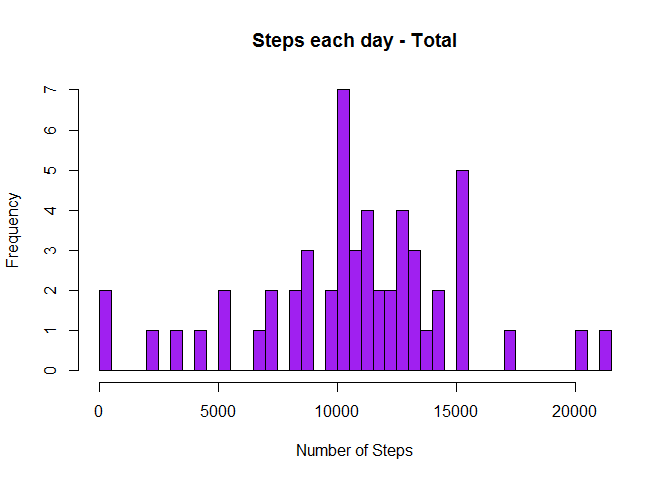
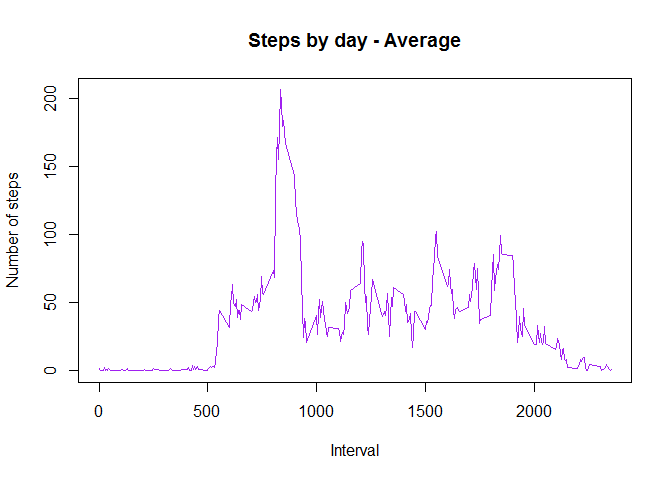
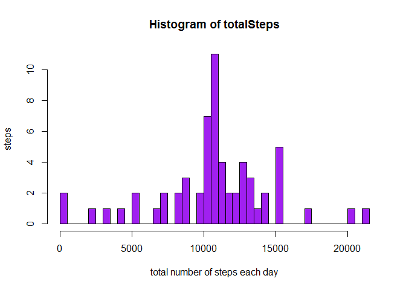

##### "Reproducible Research - Peer Assessment 1"


##### author: "AledEvans"; date: "9 June 2016"; output: html_document


#### Settings


```r
echo = TRUE # make R code always visable 
```

#### Loading and pre-processing the data


```r
# This code is for loading the data (unzip and read). dplr is loaded is loaded to aid the data analysis including activity data being structured as a tbl data frame.

library(dplyr)
```

```
## 
## Attaching package: 'dplyr'
```

```
## The following objects are masked from 'package:stats':
## 
##     filter, lag
```

```
## The following objects are masked from 'package:base':
## 
##     intersect, setdiff, setequal, union
```

```r
unzip("activity.zip")
activityData <- read.csv("activity.csv")
activityData <- tbl_df(activityData)
```


#### Histogram of total number of steps taken each day


```r
# ggplot2 is loaded for plotting the histogram. 
# The sum of the steps per day is taken. A histogram of this sum of steps is generated. 

library(ggplot2)

stepsByDay <- aggregate(steps ~ date, activityData, sum)

hist(stepsByDay$steps, breaks = 50, main = paste("Steps each day - Total"), col="purple", xlab="Number of Steps")
```

<!-- -->


#### Calculate mean total steps per day 


```r
mean((stepsByDay$steps), na.rm = TRUE)
```

```
## [1] 10766.19
```

##### Mean of the total steps per day is: 10766.19 steps


#### Calculate median total steps per day 


```r
median((stepsByDay$steps), na.rm = TRUE)
```

```
## [1] 10765
```

##### Median of the total steps per day is: 10765 steps


#### What is the average daily activity pattern?
Time series plot of the average number of steps taken.


```r
# Calulate the mean ("average") of the daily steps.
# Require ggplot2 for plot of data. 

averageSteps <- aggregate(steps ~ interval, activityData , mean)

library(ggplot2)

plot(averageSteps$interval,averageSteps$steps,type="l", main="Steps by day - Average", xlab="Interval", ylab="Number of steps", col="purple")
```

<!-- -->


#### The 5-minute interval that, on average, contains the maximum number of steps


```r
averageSteps[which.max(averageSteps$steps), ]
```

```
##     interval    steps
## 104      835 206.1698
```

##### The interval with the the maximum means steps is: 835.
##### Interval 835 contained a value of: 206.1698 steps


#### Imputing missing values


```r
# Identify number of missing values
# table with missing values

missingValues <- is.na(activityData$steps) 

table(missingValues) 
```

```
## missingValues
## FALSE  TRUE 
## 15264  2304
```

##### There are 2304 missing values.


#### fill missing data mean value


```r
# The analysis uses a function replaced the missing ("NA") values with the mean/ average steps for the interval.

fillValues <- function(steps, interval) {
    filledData <- NA
    if (!is.na(steps))
        filledData <- c(steps) else filledData <- (averageSteps[averageSteps$interval == interval, "steps"])
    return(filledData)
}
fillData <- activityData
fillData$steps <- mapply(fillValues, fillData$steps, fillData$interval)
```


#### Histogram of filled data set


```r
# Take the mean of the the total steps from teh the filled data.
# Generate histogram of using ggplot2.

totalSteps <- tapply(fillData$steps, fillData$date, FUN = sum)

library(ggplot2)

hist(totalSteps, breaks = 50, col="purple", xlab="total number of steps each day", ylab = "steps")
```

<!-- -->


#### Mean of total steps of filled/ imputed data


```r
mean(totalSteps)
```

```
## [1] 10766.19
```

##### The mean of the imputed data (i.e. totalSteps) is the total steps is 10766.19.


```r
median(totalSteps)
```

```
## [1] 10766.19
```

##### The median of the imputed data (i.e. totalSteps) is 10766.19.


#### Are there differences in activity patterns between weekdays and weekends?


```r
weekdays <- c("Monday", "Tuesday", "Wednesday", "Thursday", "Friday")
fillData$dow = as.factor(ifelse(is.element(weekdays(as.Date(fillData$date)), weekdays), "Weekdays", "Weekends"))

stepsByInterval <- aggregate(steps ~ interval + dow, fillData, mean)

library(lattice)
xyplot(stepsByInterval$steps ~ stepsByInterval$interval|stepsByInterval$dow, main="Steps by day - Average",xlab="Interval", ylab="Steps", layout=c(1,2), type="l", col="purple")
```

<!-- -->

##### The plots shows:
##### 1 - on weekdays the step activity occurs throughout the day. There is a larger peak in the weekday morning period (intervals 800 to around 950) although larger than other peaks from other day-parts, it not a considerable difference.

##### 2 - on weekends there is less step activity throughout the weekend day. However, the peak step actitvty is again between the 800 to 950 intervals - but this is considerably grearer and more distinct. There is also more step activity in the early morning at weekends (pre-interval 800) than during the comparible interval slots in weekdays. 


